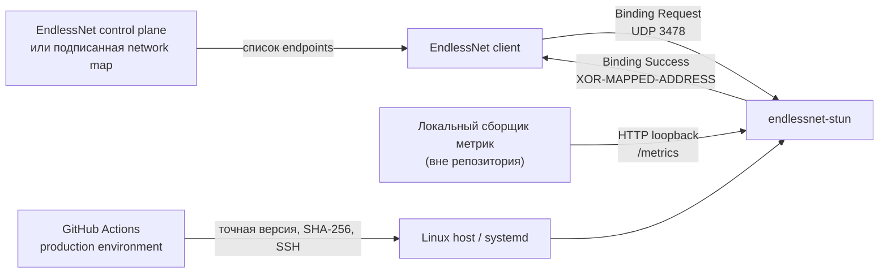
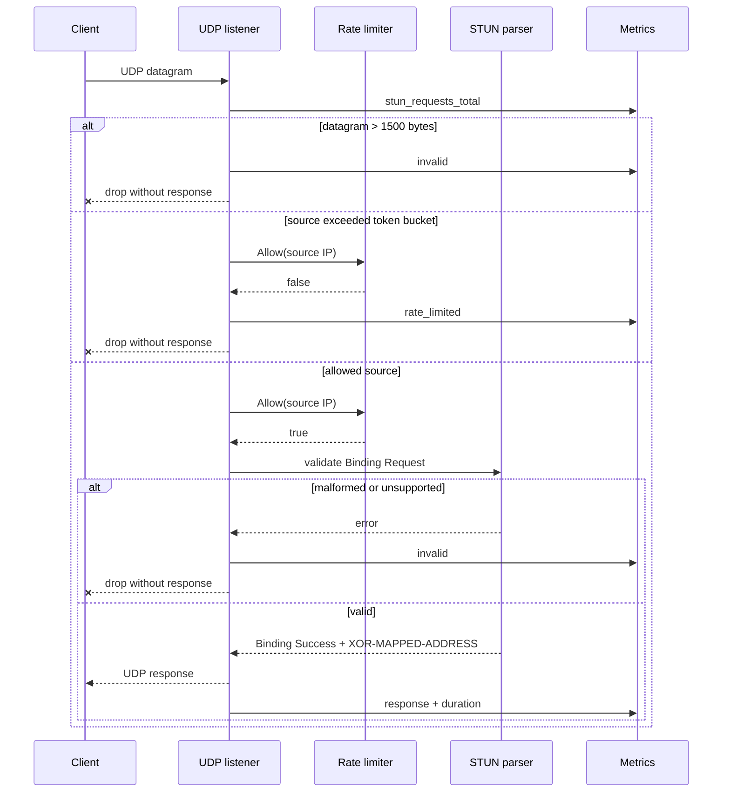

# EndlessNet STUN: устройство, решения и направления развития

## Статус документа

Документ описывает сервис в состоянии ветки `main` на 19 июля 2026 года. Источниками истины являются реализация, тесты, поставляемые конфигурации и release/deploy-процессы этого репозитория. Раздел «Возможное будущее» содержит варианты развития, а не утверждённые обязательства.

## 1. Назначение

`endlessnet-stun` — автономный stateless-сервис, который помогает клиенту EndlessNet определить видимые из интернета IP-адрес и UDP-порт. Клиент отправляет стандартный STUN Binding Request, а сервис возвращает Binding Success Response с атрибутом `XOR-MAPPED-ADDRESS`.

Сервис нужен для NAT traversal, но сам не устанавливает соединение между узлами и не передаёт пользовательский трафик.

Основные свойства:

- публичный протокол — STUN Binding поверх UDP;
- аутентификация и секреты не требуются;
- зависимости от control plane, базы данных и внутренних Go-пакетов EndlessNet отсутствуют;
- состояние запросов не хранится между пакетами и перезапусками;
- IPv4 поддержан и протестирован end-to-end, кодирование IPv6 реализовано и покрыто unit-тестами;
- один процесс может слушать несколько UDP-адресов;
- сервис поставляется как статический Linux-бинарник и контейнер.

Сервис не является TURN-сервером, relay, координатором, DNS-сервисом или системой авторизации.

## 2. Границы владения

| Область | Владелец |
| --- | --- |
| STUN-код, тесты, бинарники, образ, systemd unit, release и deploy workflow | Этот репозиторий |
| Список публичных STUN endpoints и клиентское поведение | Репозиторий `endless-net/endlessnet` |
| Сбор метрик, их хранение, алерты и дашборды | Внешняя observability-инфраструктура |
| DNS, firewall/security groups и доступность хоста | Инфраструктура окружения |

Таким образом, версия сервиса не меняет публичные DNS-имена и порты клиентов. Миграция observability-компонентов завершена: этот репозиторий только предоставляет локальные `/metrics`, `/healthz` и `/readyz`.

## 3. Системный контекст

Публичной является только UDP-плоскость STUN. HTTP-плоскость управления и наблюдаемости обязана слушать loopback-интерфейс и не входит в сетевой контракт с клиентами.

## 4. Состав сервиса

| Компонент | Ответственность |
| --- | --- |
| `cmd/endlessnet-stun` | Разбор конфигурации, запуск HTTP-сервера и UDP listeners, обработка сигналов, coordinated shutdown |
| `internal/config` | Переменные окружения и flags, приоритет flags, fail-fast валидация |
| `internal/stun/protocol.go` | Минимальная реализация STUN wire format и `XOR-MAPPED-ADDRESS` |
| `internal/stun/server.go` | UDP read/process/write loop, логирование, метрики, rate limit |
| `internal/ratelimit` | In-memory token bucket по IP источника |
| `internal/metrics` | Потокобезопасный Prometheus registry без внешних зависимостей |
| `internal/health` | `/healthz`, `/readyz`, `/metrics` |
| `cmd/endlessnet-stun-smoke` | Реальный внешний Binding probe для проверки развертывания |

В `go.mod` нет сторонних runtime-зависимостей: протокол, HTTP и UDP реализованы средствами стандартной библиотеки Go.

## 5. Обработка запроса

Порядок проверок выбран намеренно: oversized-пакеты отбрасываются сразу, а остальные запросы сначала проходят rate limit и только затем полный разбор. Поэтому некорректные пакеты также расходуют лимит источника.

Каждый UDP listener работает в своей goroutine и обрабатывает пакеты последовательно. Для каждого listener создаётся отдельный limiter; лимит не является общим между адресами одного процесса или разными узлами.

При `SIGINT` или `SIGTERM` UDP sockets закрываются, HTTP-сервер получает до 5 секунд на shutdown, после чего процесс завершается. Ошибка запуска или неожиданная остановка любого обязательного компонента останавливает весь процесс, позволяя systemd перезапустить согласованную конфигурацию целиком.

## 6. Сетевые контракты

### 6.1. Публичный STUN

- транспорт: UDP;
- стандартный порт в поставляемых примерах: `3478`;
- входящий тип: Binding Request (`0x0001`);
- исходящий тип: Binding Success Response (`0x0101`);
- исходящий атрибут: `XOR-MAPPED-ADDRESS` (`0x0020`);
- magic cookie: RFC 5389/8489;
- transaction ID: 96 бит;
- максимальный входящий datagram: 1500 байт.

Comprehension-optional атрибуты запроса игнорируются. Неизвестные comprehension-required атрибуты, неправильная длина, magic cookie, тип сообщения и иные ошибки приводят к drop без ответа. Ошибка `420 Unknown Attribute` пока не реализована.

Полная матрица поддержки находится в [supported-protocol.md](supported-protocol.md).

### 6.2. Локальный HTTP

По умолчанию HTTP слушает `127.0.0.1:9090`. Конфигурация с wildcard или публичным IP отклоняется до открытия sockets.

| Endpoint | Значение успешного ответа | Назначение |
| --- | --- | --- |
| `GET /healthz` | `200 {"status":"ok"}` | Процесс способен обслужить HTTP handler |
| `GET /readyz` | `200 {"status":"ready"}` | Активен хотя бы один UDP listener |
| `GET /readyz` | `503 {"status":"not_ready"}` | Нет активного UDP listener |
| `GET /metrics` | Prometheus text format | Локальный scrape метрик |

`/healthz` не проверяет внешнюю UDP-доступность. После deploy её подтверждает отдельный публичный smoke test.

## 7. Конфигурация

Flags имеют приоритет над переменными окружения. Вся конфигурация проверяется до запуска listeners.

| Переменная | Flag | Значение по умолчанию | Ограничения |
| --- | --- | --- | --- |
| `ENDLESSNET_STUN_ADDRS` | `--addr` | нет | Непустой CSV уникальных UDP `host:port` |
| `ENDLESSNET_STUN_METRICS_ADDR` | `--metrics-addr` | `127.0.0.1:9090` | Только loopback TCP address |
| `ENDLESSNET_STUN_RATE_LIMIT_PER_SECOND` | `--rate-limit-per-second` | `20` | Положительное целое |
| `ENDLESSNET_STUN_RATE_LIMIT_BURST` | `--rate-limit-burst` | `40` | Положительное целое |
| `ENDLESSNET_STUN_LOG_LEVEL` | `--log-level` | `info` | `debug`, `info`, `warn`, `error` |

Дополнительные flags:

- `--check-config` — проверить итоговую конфигурацию без открытия sockets;
- `--version` — вывести версию, commit и build date без обязательной runtime-конфигурации.

Файл [`configs/stun.example.env`](../configs/stun.example.env) не содержит секретов.

## 8. Ограничение нагрузки

Для каждого IP источника используется token bucket:

- скорость по умолчанию — 20 пакетов в секунду;
- burst по умолчанию — 40 пакетов;
- разные source ports используют один bucket;
- bucket считается неактивным через 5 минут и удаляется при очередной очистке;
- один limiter хранит не более 65 536 источников;
- когда таблица заполнена, новые источники отклоняются до очистки idle-записей.

Limiter хранится только в памяти. Перезапуск сбрасывает накопленное состояние, а несколько listeners и узлов не синхронизируют лимиты. Это защита процесса от локальной перегрузки, но не полноценная защита от распределённой атаки или UDP spoofing; сетевой anti-DDoS остаётся обязанностью инфраструктуры.

## 9. Наблюдаемость и приватность

Сервис пишет structured JSON logs в `stderr`. На уровне `info` фиксируются старт/остановка процесса и listeners. Отказы отдельных запросов доступны на `debug`, ошибки отправки — на `warn`.

Приняты ограничения приватности и cardinality:

- IP и порт клиента не записываются в лог, поле `remote_address` получает значение `redacted`;
- успешные адреса клиентов и тела пакетов не логируются;
- source IP не используется как label метрик;
- сервис не хранит историю запросов.

Экспортируемые метрики:

| Метрика | Тип/смысл | Labels |
| --- | --- | --- |
| `stun_requests_total` | Полученные UDP datagrams | `listener`, `address_family` |
| `stun_responses_total` | Отправленные Binding success responses | `listener`, `address_family` |
| `stun_invalid_requests_total` | Отклонённые malformed/unsupported запросы | `listener`, `address_family` |
| `stun_rate_limited_total` | Срабатывания source-IP limiter | `listener`, `address_family` |
| `stun_errors_total` | Ошибки read/write listener | `listener`, `result` |
| `stun_active_listeners` | Состояние каждого listener | `listener` |
| `stun_request_duration_seconds` | `sum` и `count` времени обработки | `listener`, `result` |
| `stun_build_info` | Версия и commit процесса | `version`, `commit` |

Минимальный рекомендуемый набор сигналов для эксплуатации: доля ответов к запросам, рост invalid/rate-limited, отсутствие активного listener, ошибки записи, задержка обработки и результат внешнего UDP probe.

## 10. Безопасность

- Публичная поверхность ограничена UDP Binding; HTTP принудительно остаётся на loopback.
- systemd запускает отдельного непривилегированного пользователя с пустым capability set, ограниченными address families и защитными sandbox-настройками.
- Container image основан на distroless и запускается как UID/GID `65532` без root и capabilities.
- Runtime не получает credentials и не подключается к БД/control plane.
- Datagram ограничен 1500 байт, malformed input покрыт table tests и fuzz test.
- CI выполняет unit/integration/race tests, `go vet`, `govulncheck`, ShellCheck и Trivy scan образа.
- Production принимает только точную semver-версию с SHA-256 и подтверждённым происхождением из merged PR в `main`.

STUN поверх UDP допускает подмену source address. Текущий limiter уменьшает нагрузку от одного наблюдаемого IP, но не заменяет ingress filtering, network rate limiting и DDoS-защиту провайдера.

## 11. Поставка и эксплуатация

### 11.1. Release

Tag вида `vMAJOR.MINOR.PATCH` запускает проверку provenance и полный quality gate, после чего публикуются:

- Linux-бинарники сервиса для AMD64 и ARM64;
- smoke-бинарники для AMD64 и ARM64;
- `checksums.txt` с SHA-256;
- GitHub Release;
- multi-architecture GHCR image с version-line tags.

Production deployment всегда использует точную версию, даже если registry дополнительно содержит major/minor tags.

### 11.2. systemd deployment

Основной production-путь — последовательный rolling deploy по SSH:

1. Проверить, что release commit находится в `origin/main` и пришёл через merged PR.
2. Скачать бинарник для архитектуры узла и сверить checksum локально и на узле.
3. Проверить конфигурацию новым бинарником через `--check-config`.
4. Поместить release в `/opt/endlessnet-stun/releases/<version>`.
5. Атомарно переключить symlink `/opt/endlessnet-stun/current`.
6. Перезапустить только `endlessnet-stun.service`.
7. Дождаться локального `/readyz`.
8. Выполнить реальный Binding probe через публичный endpoint.
9. Только после успеха перейти к следующему узлу.

При ошибке после переключения symlink восстанавливается предыдущий immutable release. Если внешний smoke test не прошёл, orchestrator также запускает rollback и повторно проверяет локальную readiness и публичный STUN. Rollout останавливается на первом проблемном узле.

### 11.3. Container

Контейнер является поддерживаемым способом упаковки и локального запуска. Production workflow в репозитории автоматизирует systemd deployment, но не Kubernetes или container orchestrator.

## 12. Проверки

| Уровень | Что подтверждается |
| --- | --- |
| Unit | Wire format IPv4/IPv6, invalid input, limiter, config, health и metrics |
| Fuzz | Parser не паникует на произвольном datagram |
| Process integration | Сборка и запуск реального бинарника, Binding, rate limit, HTTP endpoints, graceful shutdown |
| Deployment integration | Checksum, atomic switch, first install, rollback, readiness retry, изоляция systemd unit, sequential rollout |
| Provenance integration | Tag из `main`, наличие merged PR, запрет ручного deploy из другой ветки |
| CI security | `govulncheck` и scan готового container image |

Локальный полный gate запускается командой `./scripts/verify.sh`. На Windows shell/deployment-часть следует проверять в Linux или CI.

## 13. Принятые архитектурные решения

Ниже собраны решения, которые уже закреплены кодом, тестами или production workflow. Это компактный decision log; изменение любого пункта требует обновления контракта, тестов и этого документа.

| ID | Решение | Причина | Следствие |
| --- | --- | --- | --- |
| ADR-001 | Выделить STUN из основного EndlessNet в автономный сервис | Публичная инфраструктура должна работать без control plane, БД и внутренних пакетов | Независимые release/deploy и минимальный blast radius; endpoints остаются у клиента/control plane |
| ADR-002 | Оставить сервис stateless и unauthenticated | Binding discovery не требует пользовательского состояния | Нет секретов и persistent storage; restart безопасен, но limiter также сбрасывается |
| ADR-003 | Поддерживать минимальный RFC 8489/5389 Binding по UDP | Нужен небольшой совместимый NAT-discovery контракт | Нет TURN, TCP/TLS, credentials, `420 Unknown Attribute` и RFC 5780 |
| ADR-004 | Реализовать протокол стандартной библиотекой Go | Маленькая поверхность зависимостей и контролируемый wire format | Собственный parser обязан поддерживаться и тщательно тестироваться |
| ADR-005 | Ограничивать запросы token bucket по source IP | Защитить CPU и память без идентификации клиента | Limiter локален для listener/процесса и не закрывает distributed/spoofed abuse |
| ADR-006 | Отбрасывать invalid и rate-limited UDP без ответа | Минимизировать работу и ответный трафик на недоверенный input | Клиент видит timeout; расширенные STUN error responses отсутствуют |
| ADR-007 | Fail fast при ошибке обязательного listener или HTTP-компонента | Не обслуживать частично неконсистентную конфигурацию незаметно | Процесс перезапускается systemd; readiness означает наличие хотя бы одного активного listener в переходном состоянии |
| ADR-008 | Держать health/readiness/metrics только на loopback | Не расширять публичную attack surface и не делать HTTP частью клиентского контракта | Scraper должен работать на том же хосте; внешний deploy probe использует UDP |
| ADR-009 | Не включать IP клиента в logs и metric labels | Приватность и ограниченная cardinality | Для расследований доступны агрегаты, но не per-client история |
| ADR-010 | Поставлять non-root static binary и hardened runtime | Уменьшить привилегии и операционную сложность | Нет записи в файловую систему и runtime-зависимостей; конфигурация приходит извне |
| ADR-011 | Выпускать immutable semver artifacts с checksum и PR provenance | Воспроизводимый контролируемый production change | Direct/unmerged release не разворачивается; rollback не требует rebuild |
| ADR-012 | Разворачивать узлы последовательно с atomic symlink и проверкой публичного Binding | Ограничить blast radius и проверять пользовательский путь | Rollout медленнее параллельного, но останавливается после первой ошибки |
| ADR-013 | Вынести backend observability из STUN-репозитория | Разделить владение сервисом и платформой наблюдаемости | Здесь остаётся только стабильная локальная поверхность экспорта метрик |

## 14. Известные ограничения и риски

- Нет измеренного и зафиксированного capacity baseline: максимальный RPS, packet loss и CPU/RAM на целевых узлах не определены в репозитории.
- Один listener обрабатывает datagrams последовательно; масштабирование внутри одного socket не реализовано.
- Limiter не распределён и создаётся отдельно на каждый listener; его состояние теряется при restart.
- При заполнении 65 536 source buckets новые источники получают drop до очередной idle cleanup.
- Нет полноценной защиты от DDoS/reflection на сетевом периметре; это внешний инфраструктурный контроль.
- `healthz` является liveness-проверкой HTTP-процесса, а не глубокой проверкой STUN.
- `readyz` доступен только локально и не доказывает прохождение firewall/NAT/DNS снаружи.
- IPv6 protocol path реализован, но реальная доступность зависит от production network и должна проверяться отдельно.
- Совместимость ограничена минимальным Binding-набором; некоторые строгие или расширенные STUN-клиенты могут ожидать error responses или дополнительные атрибуты.
- Alert rules, SLO, dashboards и retention policy не являются частью этого репозитория, поэтому их актуальность должна контролироваться внешним владельцем observability.

## 15. Возможное будущее

Ниже — рекомендуемая последовательность обсуждения. Пункты следует принимать только при наличии измеримой потребности.

### Ближайший горизонт: сделать текущий контракт измеримым

| Инициатива | Условие принятия | Ожидаемый результат |
| --- | --- | --- |
| Зафиксировать SLI/SLO и владельца алертов | Сервис становится production dependency с формальным SLA | Единые цели по availability, latency и доле успешных Binding |
| Добавить регулярный внешний IPv4/IPv6 probe из нескольких сетей | Появляется второй регион/провайдер или IPv6 объявляется поддержанным production-контрактом | Обнаружение DNS, routing, firewall и partial outage, невидимых из host-local readiness |
| Провести load/soak test и сохранить baseline | Перед ростом трафика или изменением concurrency | Обоснованные лимиты RPS, CPU/RAM и packet loss; критерии горизонтального масштабирования |
| Описать runbook и alert mapping во внешней observability-системе | После согласования её владельца | Быстрая диагностика по каждой метрике без возвращения dashboard-кода в этот репозиторий |
| Автоматизировать проверку примеров и ссылок документации | Документация начинает часто меняться | Меньше расхождений между README, config и flags |

### Средний горизонт: совместимость и устойчивость

| Инициатива | Когда оправдана | Замечание |
| --- | --- | --- |
| `420 Unknown Attribute` и список неизвестных обязательных атрибутов | Реальные клиенты требуют полного RFC error flow | Меняет поведение с timeout на явную ошибку, нужны protocol tests |
| `FINGERPRINT` и/или `SOFTWARE` | Требуется interoperability или диагностика | Не включать идентификаторы, создающие лишнюю утечку сведений |
| Настраиваемые bounds limiter (`idleTTL`, `maxSources`) | Метрики/load test показывают давление на память или ложные drops | Значения должны оставаться bounded и проходить config validation |
| Улучшение concurrency одного listener | Один узел упирается в serial packet loop раньше сетевого лимита | Сначала benchmark; затем рассмотреть несколько workers/socket strategy без нарушения ordering assumptions |
| Canary перед rolling deploy | Число узлов и риск изменений вырастут | Сохранить exact-version, checksum, rollback и внешний smoke gate |
| SBOM, подпись artifacts/images и attestations | Появятся требования supply-chain compliance | Дополнение, а не замена checksum и PR provenance |

### Дальний горизонт: топология

- Health-aware DNS, дополнительные регионы или Anycast имеют смысл после появления целевых SLO и данных о географии клиентов.
- Edge rate limiting, anti-spoofing и managed DDoS protection следует развивать раньше, чем усложнять application limiter.
- Kubernetes deployment стоит добавлять только при стандартизации платформы на Kubernetes; текущий stateless-процесс уже подходит для горизонтального масштабирования, но новый deployment path потребует отдельных readiness, disruption и rollback tests.
- TCP/TLS STUN следует рассматривать только при подтверждённой доле сетей, где UDP недоступен.
- TURN лучше проектировать как отдельный сервис: relay требует аутентификации, квот, значительной пропускной способности, stateful allocations и другой модели угроз. Расширение текущего минимального бинарника до TURN нарушит несколько принятых решений сразу.

## 16. Вопросы, которые нужно решить до расширения

1. Каковы целевые availability, p95/p99 latency и допустимый packet loss?
2. Какой текущий и прогнозный RPS по узлу, адресу и address family?
3. Кто владеет внешними probes, alert rules, dashboards и on-call runbook?
4. Является ли IPv6 обязательным production-контрактом или best effort?
5. Какие реальные клиенты требуют STUN-атрибуты за пределами текущего минимального набора?
6. Какой уровень UDP DDoS/reflection-защиты предоставляет каждый хостинг-провайдер?
7. Нужны ли отдельные failure domains по регионам/провайдерам до внедрения Anycast?

Ответы на эти вопросы должны предшествовать выбору конкретной технологии масштабирования.

## 17. Связанные материалы

- [README](../README.md) — запуск, конфигурация, release, deploy, rollback и troubleshooting.
- [Поддерживаемый протокол](supported-protocol.md) — точная матрица STUN-функций.
- [Security policy](../SECURITY.md) — приватное сообщение об уязвимостях.
- [CHANGELOG](../CHANGELOG.md) — история выпущенных изменений.
- [Пример systemd unit](../deploy/systemd/endlessnet-stun.service).
- [Пример Docker Compose](../deploy/docker/docker-compose.example.yml).
